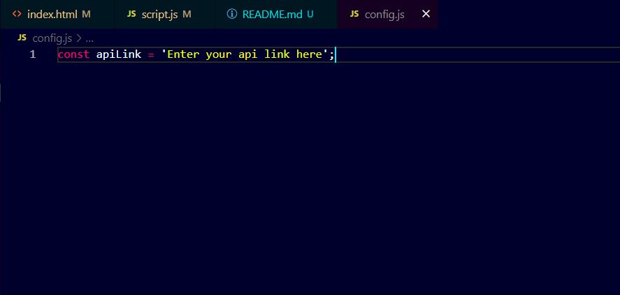

# Curency Convertor By Using ElectronJS

### API
[API-Link](https://www.exchangerate-api.com/)

### Steps to Run Program
- npm install command to install all prerequisites

- npm start for running without nodemon

- npm run watch for running with nodemon

- create config.js file and make a variable then assign your own api link into it. refer attachment - 1;

```
npm install
npm start
npm run watch
```


